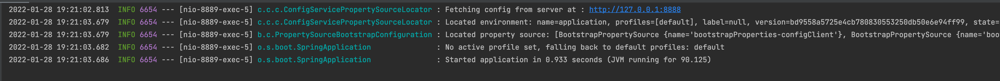
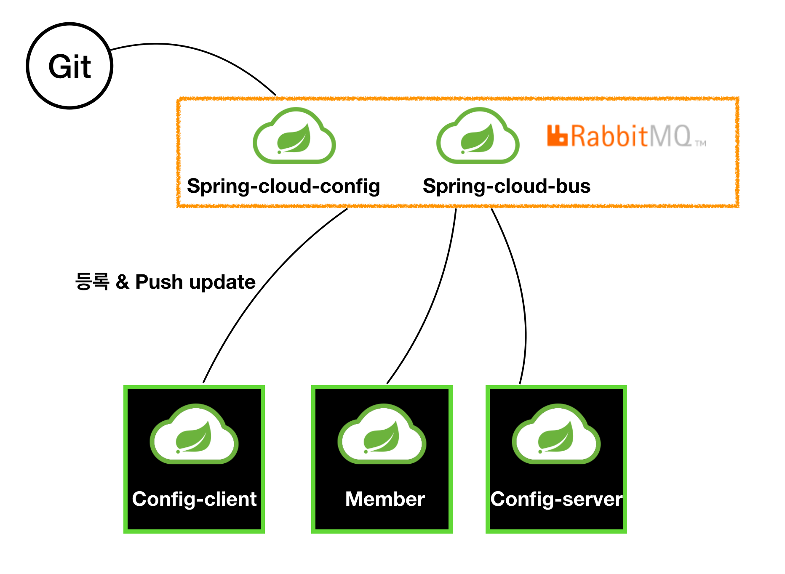
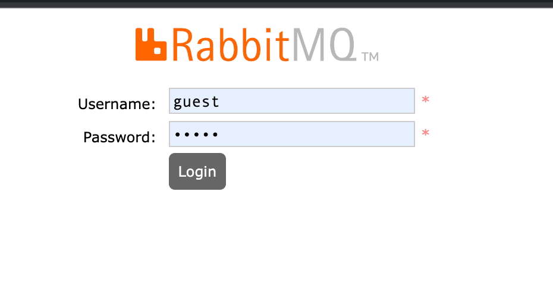

# spring-cloud config
- 서버, 클라이언트 구성에 필요한 application.yml `설정 정보`를 `외부 시스템으로 관리.`
- `마이크로 서비스를 다시 빌드&배포하지 않아도 바로 적용`할 수 있음.
- 설정 정보 저장소는 `git`, `local file` 등 여러곳이 있으며, `기본은 git 저장소`를 사용.
- dev, alpha, prod 환경에 맞는 저장소를 사용해야함.

## spring-cloud config 적용
### config 생성 
- config를 어디에 저장할지 택해야 하는데, 제일 많이 사용하는 `git`을 선택 
- config 정보를 저장할 위치를 정해야하는데, spring-cloud 모듈 바로 밑에 `application.yml`을 추가해둠.
  ```
  default:
    content: Hi~ spring-cloud-config test.
  ```
- 테스트를 위해 내용은 `default.content`로 만들어둠

### config-server 생성 
- 생성해둔 설정 정보를 셋팅하는 `config-server` 모듈 추가 
- gradle dependency
  ```
  implementation 'org.springframework.cloud:spring-cloud-config-server'
  ```
- `@EnableConfigServer` 어노테이션 추가.
  ```
  @SpringBootApplication
  @EnableConfigServer
  public class ConfigServerApplication {
    public static void main(String[] args) {
      SpringApplication.run(ConfigServerApplication.class, args);
    }
  }
  ```
- application.yml
  ```
  server:
    port: 8888

  spring:
    application:
      name: config-server
    cloud:
      config:
        server:
          git:
            uri: https://github.com/LEEHANI/spring-cloud
  ```   
- server port는 `8888`로 많이 사용.
- 위에 만들어뒀던 `application.yml`의 위치를 `spring.cloud.config.server.git.uri`에 지정 

## config-server 구동 및 테스트 
- 서버를 구동시키고 `http://localhost:8888/config-server/dev` 를 호출해보자. 
  ```json 
  {
    "name": "config-server",
    "profiles": ["dev"],
    "label": null,
    "version": "bd9558a5725e4cb780830553250db50e6e94ff99",
    "state": null,
    "propertySources": [
      {
        "name": "https://github.com/LEEHANI/spring-cloud/application.yml",
        "source": {
          "default.content": "Hi~ spring-cloud-config test."
        }
      }
    ]
  }
  ```
- 호출해보면 설정한 정보들이 나온다. 
  ```
  GET /{application}/{profile}[/{label}]
  GET /{application}-{profile}.yml
  GET /{label}/{application}-{profile}.yml
  GET /{application}-{profile}.properties
  GET /{label}/{application}-{profile}.properties
  ```
- 엔드 포인트는 다음과 같이 갖게된다. 
- `application`은 `spring.config.name`이고 디폴트 값은 `application`이다.
- `profile`은 `properties`값이다. 
- `label`은 `git label`이다. 디폴트는 master
- `http://localhost:8888/application-default.yml` 로 호출해보면 엔드 포인트의 의미를 알 수 있을 것이다.

## config-client 생성 
- 기존 member 서버에 설정해줘도 되지만 처음해보는 것이니 `config-client` 서버를 생성했다. 
- gradle dependency
  ```  
  implementation('org.springframework.boot:spring-boot-starter-web')
  implementation('org.springframework.cloud:spring-cloud-starter-config')
  implementation('org.springframework.cloud:spring-cloud-starter-bootstrap')
  ```
- 스프링 부트가 가동될때, config 서버의 설정을 가장 먼저 읽어야하는데 `application.yml`보다 먼저 로드되는 `bootstrap.yml`을 등록 해야함.
- `resources/bootstrap.yml 생성`
  ```
  spring:
    cloud:
      config:
        uri: http://127.0.0.1:8888
        name: application 
  ```
  + `application-dev.yml`을 읽어오고 싶다면, `bootstrap.yml`에 `spring.profiles.active: dev` 추가
- application.yml 에는 기본 설정만 등록. 
  ```
  server:
    port: 8889
  spring:
    application:
      name: config-client  
  ```
- git에 만든 config 설정을 잘 가져오는지 확인하기 위해 간단한 api 추가. 
  ```
  @RequiredArgsConstructor
  @RestController
  public class ConfigClientController {

    private final Environment env;

    @GetMapping("/health-check")
    public String statue() {
        return String.format("config-client service" +
                ", port(local.server.port) = " + env.getProperty("local.server.port") +
                ", default.content = " + env.getProperty("default.content")
        );
    }
  }
  ```

## config-client 구동 및 테스트 
- `config-server`가 구동되어 있는 상태에서 `config-client`를 구동 시키자. 
- `http://localhost:8889/health-check` 를 호출. 
  ```
  config-client service, port(local.server.port) = 8889, default.content = Hi~ spring-cloud-config test. 
  ```
- git 저장소에 생성해뒀던 `default.content` 설정 값을 잘 가져오고 있다. 
- 여기서 git application.yml을 수정해보자. `update config file test` 문장을 추가했다.  
  ```
  default:
    content: Hi~ spring-cloud-config test. update config file test 
  ```
- 하지만 git application.yml를 수정했다고 해서 설정이 바로 적용되지 않는다. 
- config-client 서버를 재구동 시키면 설정 값이 반영된다.. 
- 뭔가 이상하다. 서버를 빌드&재배포 하지 않기 위해 spring-cloud-config를 사용하는 것인데 서버를 재구동 시켜야한다니 

## 변경된 config 적용 방법 
1. 서버 재구동. 
2. actuator refresh. 
3. spring-cloud-bus
- 2, 3번 방법에 대해 더 알아보자.

## config 적용 방법 - 2. spring actuator 
- `spring actuator`로 `애플리케이션 상태`를 `모니터링` 할 수 있다.
- 예를 들어, `health check`, `사용중인 빈 조회`, `세션 조회` 등이 있다. 
  + https://docs.spring.io/spring-boot/docs/current/reference/html/actuator.html
- `actuator`의 `refresh`를 사용하면 `서버를 재구동하지 않아도` 변경된 `config 정보를 다시 적용`시킬 수 있다.  
- gradle 
  ``` 
  implementation('org.springframework.boot:spring-boot-starter-actuator')
  ```
- application.yml에 모니터링할 엔드포인트를 추가. 
  ```
  management:
    endpoints:
      web:
        exposure:
          include: refresh, health, beans 
  ```

- `http://localhost:8889/actuator/health` 를 호출해보자. `status: up`이 보인다면 actuator 연결에 성공 
- 기존에 만든 health-check api대신 `actuator/health`를 사용해도 무방하다. 
- config server에 변경된 config 정보를 다시 호출하려면 `curl -XPOST http://localhost:8889/actuator/refrsh` 를 호출하면 된다. 

- 정상 호출 되면 위 로그를 볼 수 있다. 
- `actuator`를 사용해도 여전히 단점은 존재한다. `config 설정이 바뀔 때마다 적용시키기 위해 서비스마다 actuator/refresh`를 호출해줘야한다.  

## config 적용 방법 - 3. spring-cloud-bus

- 2번 방법으로는 빌드&배포는 안해줘도 되지만 변경시 서비스마다 `actuator/refresh`를 호출해줘야하는 단점이 있다.
- `spring-cloud-bus`를 적용하면, `하나의 서비스 갱신`으로 `버스로 연결된 클라이언트들의 설정 정보가 전부 업데이트`된다.
- `마이크로 서비스`를 RabbitMQ나 Kafka 같은 `메시지 브로커와 연결`하고, 변경 사항을 연결된 서비스에게 `broadcast` 전달한다.  
- RabbitMQ로 설정 및 테스트를 해보자 

### spring-cloud-bus 적용  
- docker RabbitMQ 설치 및 실행  
  ``` 
  docker pull rabbitmq:3-management
  docker run -d -p 15672:15672 -p 5672:5672 --name  msa-rabbitmq rabbitmq:3-management
  ```

- docker로 정상적으로 실행되면 `http://localhost:15672/`로 접속. id, passwd는 guest:guest  
- config-server, config-client, member에 gradle 추가. actuator가 없다면 덤으로 추가.  
  ```
  implementation('org.springframework.cloud:spring-cloud-starter-bus-amqp') 
  ```
- application.yml에 rabbitmq 설정과 actuator 엔드포인트 busrefresh 추가 
  ``` 
  spring:
    rabbitmq:
      host: 127.0.0.1
      port: 5672
      username: guest
      password: guest
  management:
    endpoints:
      web:
        exposure:
          include: refresh,health,beans,busrefresh  
  ```
  
### spring-cloud-bus 구동 및 테스트  
- rabbitmq, eureka-server, member, config-server, config-client를 순서대로 구동시키자. 
- `spring-cloud/application.yml`를 수정하고 push. 
- acutuator가 등록되어 있고, cloud-bus로 연결한 서비스 중 아무거나 하나 골라서 refresh 해보자
  ```
  curl -X POST "http://localhost:8081/actuator/busrefresh"
  ```
- refresh 후 확인해보면 모든 서비스에 설정 정보가 갱신된걸 확인할 수 있다. 
- 이제 `bus`로 연결되어있느 서비스를 하나만 `refresh`해도 연결된 다른 서비스에도 갱신이 된다.  

